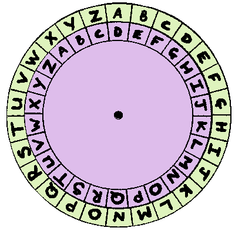

# **Ceaser Cipher**

  

## **Overview**

**What is the Caesar Cipher?**

The Caesar cipher is an encryption technique where each letter in the alphabet is replaced by another letter that is a fixed number of positions down the alphabet. This process wraps around from Z back to A when necessary.

For example, with a Caesar cipher that has a shift of three:

- A is replaced by D.
- B is replaced by E.
- C is replaced by F.
- and so on.

The shift parameter serves as the key for the Caesar cipher and is used for both encrypting and decrypting texts. By default, the Caesar cipher uses a key of 3.

This method is believed to have been used by Julius Caesar for his private correspondence. However, the Caesar cipher is no longer considered secure, as it can be easily decrypted using brute-force algorithms. Despite its simplicity, it remains an excellent introduction to the world of cryptography and serves as an enjoyable programming exercise.

**Purpose of Program**

- Encrypt files using a specified key.
- Decrypt files using a specified key.
- Decrypt files using brute force.

## **Usage**

...

## **Timeline**

**Task 1**

- [x] Implement Core Functionality (Encryption & Decryption).

**Task 2**

- [x] Implement Command Line Arguments.

**Task 3**

- [ ] Implement Brute Force Algorithm.
  - Learn the [`subprocess` module](https://www.youtube.com/watch?v=2Fp1N6dof0Y)
  - Train a Machine Learning Model to differentiate between Legible text and non-legible text.
