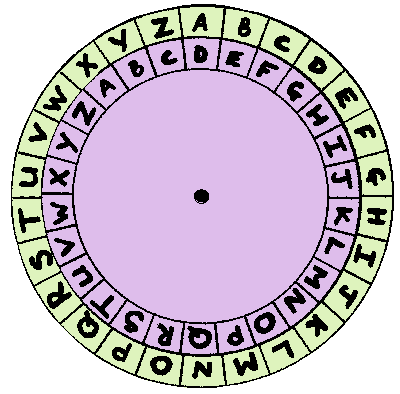

# **Ceaser Cipher**

<p align="center">
  
</p>

## Overview

### What is the Caesar Cipher?

The **Caesar cipher** is an encryption technique where each letter in the alphabet is replaced by another letter that is a fixed number of positions down the alphabet. This process wraps around from Z back to A when necessary.

For example, with a Caesar cipher that has a **shift of three**:

- A is replaced by D
- B is replaced by E
- C is replaced by F
- and so on.

The **shift parameter** serves as the key for the Caesar cipher and is used for both encrypting and decrypting texts. By default, the Caesar cipher uses a key of **-3**, where the minus sign indicates a shift to the left.

This method is believed to have been used by **Julius Caesar** for his private correspondence. However, the Caesar cipher is no longer considered secure, as it can be easily decrypted using brute-force algorithms. Despite its simplicity, it remains an excellent introduction to the world of cryptography and serves as an enjoyable programming exercise.

### Purpose of Program

The purpose of this program is to provide users with the ability to **encrypt** and **decrypt** files using a specified key.

In addition, we implement a **brute force feature** that allows users to decrypt files when the key is unknown.

## Usage

```python
from typing import List
from string import (
    ascii_lowercase as ASCII_LOWERCASE,
    ascii_uppercase as ASCII_UPPERCASE,
)
import re
```

## Timeline

- [x] Task 1:

  - [x] Implement internal functions.
  - [x] Implement external functions.

- [ ] Task 2:

  - [ ] Modification: `encrypt` and `decrypt` must provide the option to either overwrite the file (default behavior) or save to another file.
  - [ ] Implement Command Line Arguments
